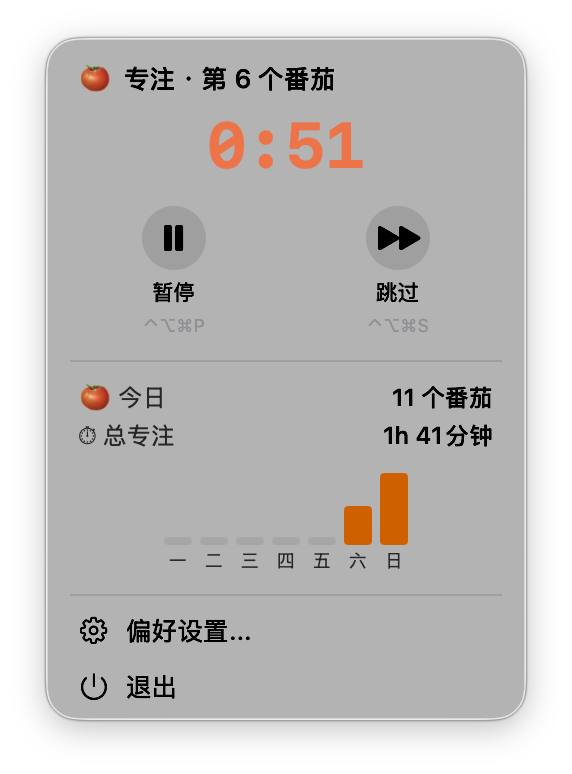
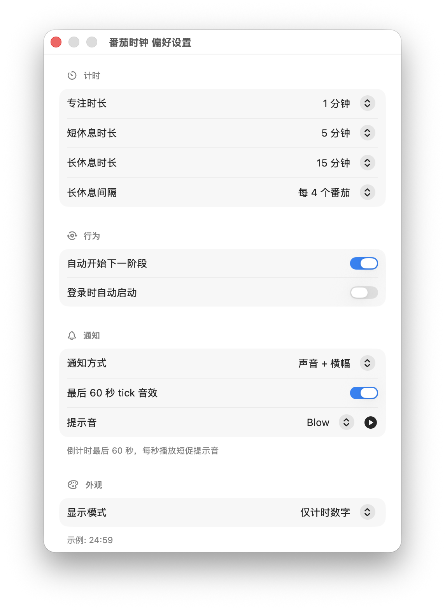

<picture>
  <source media="(prefers-color-scheme: dark)" srcset="https://img.shields.io/badge/macOS-14.0%2B-blue?logo=apple">
  
</picture>
<a href="https://github.com/raymondjxj/PomodoroNotch/releases/latest"></a>
<a href="LICENSE"></a>

# 🍅 番茄时钟 (PomodoroNotch)

> A minimal, beautiful Pomodoro timer that lives in your Mac menu bar.
> Zero clicks to see your remaining time. Zero dependencies.





---

## Why

Most Pomodoro timers are either bloated Electron apps that consume 500MB of RAM, or web-based tools that require you to keep a browser tab open. Neither respects your focus.

**番茄时钟** is 7 Swift files, ~1,000 lines of code, and sits in your menu bar. It uses <2MB of memory, <0.5% CPU, and never touches the network.

- **Glance-able** — countdown visible in the menu bar at all times
- **Keyboard-driven** — `⌃⌥⌘P` to start/pause, `⌃⌥⌘S` to skip, `⌃⌥⌘R` to reset
- **Non-intrusive** — system notifications on phase completion, optional tick sounds in the final minute

---

## Features

- **Menu bar timer** — countdown displayed directly in the menu bar with color-coded phases (orange = focus, green = break, gray = paused)
- **Two display modes** — `24:59` (time only) or `🍅 25m` (icon + minutes)
- **Pomodoro state machine** — focus → short break → focus → long break → loop, with configurable durations
- **Pause & resume** — preserves timer state across pauses; timer survives app restart via `UserDefaults` persistence
- **Dropdown panel** — large in-panel timer, play/pause/skip controls, today's stats, weekly bar chart
- **12 tick sounds** — Tink, Pop, Blow, Bottle, Frog, Funk, Hero, Morse, Ping, Purr, Sosumi, Submarine — with live preview
- **Global keyboard shortcuts** — `⌃⌥⌘P` toggle, `⌃⌥⌘S` skip, `⌃⌥⌘R` reset
- **System notifications** — configurable: sound + banner / sound only / banner only / off
- **Sleep-aware** — recalculates elapsed time when the Mac wakes from sleep
- **Launch at login** — optional, via `SMAppService`
- **Weekly stats** — persisted to `~/Library/Application Support/PomodoroNotch/stats.json`
- **macOS native** — built with SwiftUI `MenuBarExtra`, SF Symbols, and system sounds. No Electron, no Catalyst.

---

## Install

### Download DMG

[**Latest Release →**](https://github.com/raymondjxj/PomodoroNotch/releases/latest)

Download `PomodoroNotch-*.dmg`, open it, and drag **番茄时钟** to your Applications folder.

### Build from Source

```bash
git clone https://github.com/raymondjxj/PomodoroNotch.git
cd PomodoroNotch
make run
```

Requires **Xcode 16+** (Swift 6) and **macOS 14.0+**.

### Homebrew (coming soon)

```bash
brew install --cask pomodoro-notch
```

---

## Usage

### Menu Bar

| State | What you see |
|-------|-------------|
| Idle | `·` (gray dot) |
| Focusing | `24:59` or `🍅 25m` in orange |
| On break | `04:32` or `☕ 5m` in green |
| Paused | Pulsing gray countdown |

**Click** the timer → dropdown panel with controls, stats, and preferences.  
**Click anywhere outside** → panel closes.

### Keyboard Shortcuts

| Shortcut | Action |
|----------|--------|
| `⌃⌥⌘P` | Start / Pause / Resume |
| `⌃⌥⌘S` | Skip current phase |
| `⌃⌥⌘R` | Reset timer |

For global shortcuts (works while other apps are focused), grant **Accessibility** permission in System Settings → Privacy & Security → Accessibility.

### Preferences

Open via the dropdown panel → **⚙ 偏好设置...**

| Tab | What you can configure |
|-----|----------------------|
| **计时** (Timer) | Focus (1–120min), short break (1–30min), long break (5–60min), long break interval (every 2–6 pomodoros), auto-start next phase, launch at login |
| **外观** (Appearance) | Menu bar display mode: time only (`24:59`) or icon + minutes (`🍅 25m`) |
| **通知** (Notifications) | Alert style (sound+banner / sound / banner / off), tick sound toggle, tick sound selection (12 options) with play preview button |
| **快捷键** (Shortcuts) | View current bindings |

---

## Architecture

```
Sources/PomodoroNotch/
├── App.swift                  # @main entry, MenuBarExtra, TimerLabel, DropdownPanel, AppDelegate
├── PomodoroTimer.swift        # State machine, countdown engine, persistence
├── PreferencesView.swift      # Preferences window (4 tabs)
├── PreferencesStore.swift     # @AppStorage-backed settings
├── StatisticsStore.swift      # Daily/weekly stats, JSON persistence
├── NotificationManager.swift  # UserNotifications + delegate
└── SoundPlayer.swift          # System sound playback, tick sound cache
```

**7 files. ~1,000 lines. Zero external dependencies.**

### State Machine

```
IDLE ──click──▶ FOCUS ──timer end──▶ BREAK ──timer end──▶ FOCUS (loop)
  ▲               │    ▲                │    ▲               │
  │               ▼    │                ▼    │               │
  └──reset── PAUSED ──resume──    PAUSED ──resume──         ...
```

- FOCUS completes → short break (or long break every Nth round)
- BREAK completes → next focus round begins
- PAUSED preserves the underlying phase

### Data Flow

```
NSEvent (keyboard)
  → AppDelegate.handleShortcutEvent()
    → NotificationCenter (.shortcutToggle / .shortcutSkip / .shortcutReset)
      → AppState (observer)
        → PomodoroTimer.startOrPause() / skip() / reset()
          → @Published phase, remainingSeconds
            → TimerLabel (menu bar display)
            → DropdownPanel (dropdown UI)
```

Timer state is preserved via `UserDefaults` on every phase change. On restart, elapsed time is recalculated from `phaseStartedAt`.

---

## FAQ

**The menu bar item doesn't show up.**  
Check **System Settings → Control Center** and make sure "番茄时钟" is set to "Show in Menu Bar". This is a macOS 26+ behavior.

**Global shortcuts don't work.**  
Grant Accessibility permission in **System Settings → Privacy & Security → Accessibility**.

**The app uses 0% CPU.**  
The timer ticks once per second via `Timer.scheduledTimer`. When idle, no timer runs. The menu bar label updates only when `@Published` properties change.

**Can I use this on Intel Macs?**  
Yes. Build with `swift build --arch x86_64` or use the universal DMG from Releases.

---

## Internationalization

App UI supports 11 languages (auto-detected or manual selection):
**简体中文 · English · 繁體中文 · Français · 日本語 · Deutsch · Italiano · Español · Português · Bahasa Indonesia · Русский**

[English](docs/README.en.md) · [繁體中文](docs/README.zh-Hant.md) · [Français](docs/README.fr.md) · [日本語](docs/README.ja.md) · [Deutsch](docs/README.de.md) · [Italiano](docs/README.it.md) · [Español](docs/README.es.md) · [Português](docs/README.pt.md) · [Bahasa Indonesia](docs/README.id.md) · [Русский](docs/README.ru.md)

## License

MIT © [raymondjxj](https://github.com/raymondjxj)
